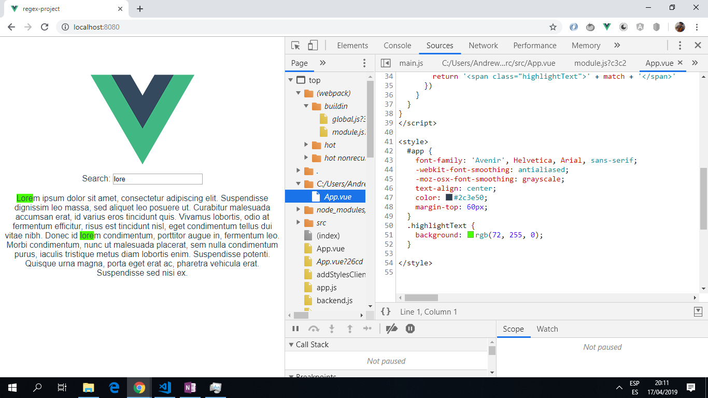

# Vue Regex Project

Vue app to highlight matching search text in a string using a regular expression.

*** Note: to open web links in a new window use: _ctrl+click on link_**

## Table of contents

* [General info](#general-info)
* [Screenshots](#screenshots)
* [Technologies](#technologies)
* [Setup](#setup)
* [Features](#features)
* [Status](#status)
* [Inspiration](#inspiration)
* [Contact](#contact)

## General info

* The matching text is replaced with a HTML-wrapped equivalent that has a class that changes the background color.

* A regular expression is used to find and replace the matching search text.

## Screenshots

.

## Technologies

* [Vue framework v2.6.10](https://vuejs.org/)

* [Vuex v3.0.1](https://github.com/vuejs/vuex) a central location from which state data is stored, modified and accessed.

* [Vue CLI v3.6.0](https://github.com/vuejs/vue-cli)

* [Vue DevTools extension for Chrome](https://chrome.google.com/webstore/detail/vuejs-devtools/nhdogjmejiglipccpnnnanhbledajbpd) was useful for debugging and seeing what was happening with the state when Vuex was used.

## Setup

Run `npm run dev` for a dev server. Navigate to `http://localhost:8080/`. The app will automatically reload if you change any of the source files.

## Code Examples

* extract of `<script>` from App.vue

```javascript
export default {
  name: 'app',

  // inialise 2 variables, query = user input, content = text to be searched.
  data () {
    return {
      query: '',
      content: 'Lorem ipsum dolor sit amet, consectetur adipiscing elit. Suspendisse dignissim leo massa, sed aliquet leo posuere ut. Curabitur malesuada accumsan erat, id varius eros tincidunt quis. Vivamus lobortis, odio at fermentum efficitur, risus est tincidunt nisl, eget condimentum tellus dui vitae nibh. Donec id lorem condimentum, porttitor augue in, fermentum leo. Morbi condimentum, nunc ut malesuada placerat, sem nulla condimentum purus, iaculis tristique metus diam lobortis enim. Suspendisse potenti. Quisque urna magna, porta eget erat ac, pharetra vehicula erat. Suspendisse sed nisi ex.'
    }
  },

  // If query empty just return.
  // function highlight() is called if query is not empty.
  // It highlights query text by changing the class around the matching text.
  methods: {
    highlight () {
      if (!this.query) {
        return this.content
      }
      return this.content.replace(new RegExp(this.query, 'gi'), match => {
        return '<span class="highlightText">' + match + '</span>'
      })
    }
  }
}

```

## Features

* search for any text string within the lorem ipsum texwt supplied and it will be highlighted in bright green.

## Status & To-Do List

* Status: Tested and 100% working.

* To-Do: add functionality.

## Inspiration

* [Nic Raboy of X-Team.com: "Highlighting Text Within a String Using Vue.js and Regular Expressions"](https://x-team.com/blog/highlight-text-vue-regex/)

## Contact

Created by [ABateman](https://www.andrewbateman.org) - feel free to contact me!
